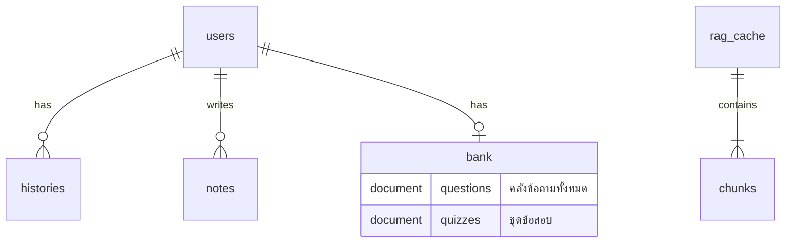

# 🗄️ Firestore Database Design (การออกแบบฐานข้อมูล Firestore)

เอกสารฉบับนี้อธิบายโครงสร้างและการออกแบบฐานข้อมูล **Google Cloud Firestore (NoSQL)** ของระบบ **EduGen** เพื่อใช้เป็นข้อมูลอ้างอิงสำหรับการพัฒนาและตรวจสอบโครงสร้างข้อมูลทั้งฝั่ง Frontend และ Backend

---

## 📌 ภาพรวมสถาปัตยกรรม (Architecture Overview)

ระบบใช้ Firestore ในรูปแบบ NoSQL Document Database โดยโครงสร้างหลักแบ่งออกเป็น 2 ส่วนหลักคือ:
1. **คลังข้อมูลผู้ใช้ (`users`)**: เก็บข้อมูลส่วนบุคคล ประวัติการเรียนรู้ คลังข้อสอบ และโน้ตย่อ โดยออกแบบให้เป็นแบบ Subcollection ตามหลักสิทธิ์และการเข้าถึงข้อมูลเฉพาะของแต่ละบุคคล
2. **ระบบ RAG Cache (`rag_cache`)**: เก็บข้อความและ Vector Embeddings สำหรับระบบสืบค้นข้อมูลเชิงความหมาย (Semantic Search/RAG) เพื่อให้สามารถสืบค้นเนื้อหาที่เกี่ยวข้องได้อย่างรวดเร็ว



---

## 1. Root Collection: `users`

เก็บข้อมูลของแต่ละผู้ใช้ โดยใช้ **Firebase Auth UID** เป็น Document ID (`{uid}`)

### 1.1 Subcollection: `users/{uid}/bank`
ใช้เก็บคลังข้อสอบและข้อถามส่วนตัวของผู้ใช้ โดยออกแบบในรูปแบบ **Single Document with Array** เพื่อลดจำนวนการอ่าน/เขียน (Read/Write Operations) และประหยัดค่าใช้จ่าย เนื่องจากจำนวนข้อสอบต่อคนมักอยู่ในเกณฑ์ที่จำกัด

#### A. Document: `questions` (คลังข้อคำถามทั้งหมด)
* **ID:** `questions`
* **ข้อมูลภายใน:**

| Field | Type | Description |
| :--- | :--- | :--- |
| `items` | Array (Map) | รายการข้อคำถามทั้งหมดที่ผู้ใช้บันทึกไว้ในคลัง |

**โครงสร้างย่อยของแต่ละ Map ใน `items` (Question Object):**

| Field | Type | Required | Description / Constraints |
| :--- | :--- | :---: | :--- |
| `id` | Integer | Yes | รหัสคำถาม (รันเลขแบบ Auto-increment ภายในระบบของแต่ละผู้ใช้) |
| `type` | String | Yes | ประเภทข้อสอบ: `"mcq"` (ปรนัย 4 ตัวเลือก) หรือ `"tf"` (ถูก/ผิด) |
| `question` | String | Yes | ตัวคำถามหลัก |
| `choices` | Array (String) \| Null | Yes (MCQ) | ตัวเลือกสำหรับ MCQ (ความยาว 4 รายการ: ก, ข, ค, ง) / `null` สำหรับ TF |
| `answer` | String | Yes | คำตอบที่ถูกต้อง: `"ก"`/`"ข"`/`"ค"`/`"ง"` (MCQ) หรือ `"true"`/`"false"` (TF) |
| `explain` | String | No | คำอธิบายคำตอบเฉลย |
| `topic` | String | No | หัวข้อหรือหมวดหมู่ของคำถาม |

*ตัวอย่าง Document `questions`:*
```json
{
  "items": [
    {
      "id": 1,
      "type": "mcq",
      "question": "ข้อใดคือหน่วยพื้นฐานที่สุดของสิ่งมีชีวิต?",
      "choices": ["ก) นิวเคลียส", "ข) เซลล์", "ค) ออร์แกเนลล์", "ง) ไซโทพลาซึม"],
      "answer": "ข",
      "explain": "เซลล์ (Cell) คือหน่วยโครงสร้างพื้นฐานที่เล็กที่สุดของสิ่งมีชีวิตทุกชนิด",
      "topic": "วิทยาศาสตร์ทั่วไป"
    },
    {
      "id": 2,
      "type": "tf",
      "question": "น้ำประกอบด้วยธาตุไฮโดรเจนและคาร์บอน",
      "choices": null,
      "answer": "false",
      "explain": "น้ำ (H2O) ประกอบด้วยธาตุไฮโดรเจนและออกซิเจน",
      "topic": "เคมีเบื้องต้น"
    }
  ]
}
```

---

#### B. Document: `quizzes` (ชุดข้อสอบ)
* **ID:** `quizzes`
* **ข้อมูลภายใน:**

| Field | Type | Description |
| :--- | :--- | :--- |
| `items` | Array (Map) | รายการชุดข้อสอบ (Quiz Sets) ที่สร้างขึ้นมาโดยดึงข้อถามจากคลัง |

**โครงสร้างย่อยของแต่ละ Map ใน `items` (Quiz Object):**

| Field | Type | Required | Description / Constraints |
| :--- | :--- | :---: | :--- |
| `id` | Integer | Yes | รหัสชุดข้อสอบ (รันเลขแบบ Auto-increment) |
| `title` | String | Yes | ชื่อหรือหัวข้อของชุดข้อสอบ (Default: `"แบบทดสอบ"`) |
| `question_ids` | Array (Integer) | Yes | รายการของ `id` ข้อคำถามที่ถูกมัดรวมกันในชุดข้อสอบนี้ (เชื่อมกับ `questions` Doc) |
| `created_at` | String (ISO) | Yes | วันเวลาที่สร้างในรูปแบบ UTC (เช่น `"2026-07-10T06:14:00Z"`) |
| `updated_at` | String (ISO) | Yes | วันเวลาที่มีการแก้ไขล่าสุด |

*ตัวอย่าง Document `quizzes`:*
```json
{
  "items": [
    {
      "id": 1,
      "title": "แบบทดสอบชีววิทยาและเคมี 101",
      "question_ids": [1, 2],
      "created_at": "2026-07-10T06:15:32Z",
      "updated_at": "2026-07-10T06:15:32Z"
    }
  ]
}
```

---

### 1.2 Subcollection: `users/{uid}/histories`
เก็บประวัติการทำข้อสอบและการประมวลผล PDF/เอกสารของแต่ละครั้ง

* **ID:** Auto-generated ID (จาก Firestore)
* **ข้อมูลภายใน Document:**

| Field | Type | Required | Description |
| :--- | :--- | :---: | :--- |
| `fileName` | String | Yes | ชื่อไฟล์ PDF หรือหัวข้อข้อมูลต้นฉบับ |
| `overview` | String | Yes | บทสรุปภาพรวม (Overview) ที่สร้างโดย AI |
| `keyPoints` | Array (String) | Yes | ประเด็นสำคัญที่มีประโยชน์ (Key Points) |
| `sections` | Array (Map) | Yes | สรุปเนื้อหาแยกตามส่วนหรือหัวข้อย่อย (`title`, `content`) |
| `dataPoints` | Array (Map) | Yes | ข้อมูลตัวเลข สถิติ หรือนิยามสำคัญ (`key`, `value`) |
| `questions` | Array (Map) | Yes | รายการคำถามข้อสอบทั้งหมดที่ระบบสร้างขึ้นมาสำหรับเซสชันนี้ |
| `answers` | Map (String -> String) | Yes | คำตอบที่ผู้ใช้ส่ง (Key คือไอดีคำถามในรูป String, Value คือคำตอบที่ตอบ) |
| `score` | Integer | Yes | คะแนนรวมที่ผู้ใช้ทำได้จากการตอบคำถามครั้งนี้ |
| `totalQuestions`| Integer | Yes | จำนวนคำถามรวมทั้งหมดในประวัตินี้ |
| `content` | String | Yes | ข้อความเต็ม (Raw text) ที่สกัดออกมาจากไฟล์ต้นฉบับ |
| `timestamp` | String (ISO) | Yes | วันเวลาที่บันทึกข้อมูล (ใช้สำหรับจัดเรียงประวัติ) |
| `qa_history` | Array (Map) | Yes | ประวัติการถาม-ตอบเฉพาะจุดของเอกสารนี้ (`question`, `answer`) |

*ตัวอย่าง Document ใน `histories`:*
```json
{
  "fileName": "ระบบสุริยะ.pdf",
  "overview": "สรุปเกี่ยวกับดวงดาวบริวารและดาวเคราะห์ในระบบสุริยะ...",
  "keyPoints": [
    "ดวงอาทิตย์เป็นศูนย์กลางของระบบสุริยะ",
    "ดาวพุธเป็นดาวเคราะห์ที่อยู่ใกล้ดวงอาทิตย์ที่สุด"
  ],
  "sections": [
    {
      "title": "ดวงอาทิตย์ (The Sun)",
      "content": "ดวงอาทิตย์เป็นดาวฤกษ์ดวงเดียวในระบบสุริยะ มีมวลคิดเป็น..."
    }
  ],
  "dataPoints": [
    {
      "key": "จำนวนดาวเคราะห์บริวาร",
      "value": "8 ดวง"
    }
  ],
  "questions": [
    {
      "id": 0,
      "type": "mcq",
      "question": "ดาวเคราะห์ดวงใดมีขนาดใหญ่ที่สุด?",
      "choices": ["ก) โลก", "ข) ดาวอังคาร", "ค) ดาวพฤหัสบดี", "ง) ดาวเสาร์"],
      "answer": "ค",
      "explain": "ดาวพฤหัสบดีคือดาวเคราะห์แก๊สยักษ์ที่มีปริมาตรใหญ่ที่สุดในระบบ",
      "topic": "ดาราศาสตร์"
    }
  ],
  "answers": {
    "0": "ค"
  },
  "score": 1,
  "totalQuestions": 1,
  "content": "ระบบสุริยะประกอบด้วยดวงอาทิตย์เป็นศูนย์กลางและมีดาวเคราะห์บริวาร...",
  "timestamp": "2026-07-10T06:14:12Z",
  "qa_history": [
    {
      "question": "ดาวศุกร์มีลักษณะเด่นอย่างไร?",
      "answer": "ดาวศุกร์เป็นดาวเคราะห์ที่ร้อนที่สุดเนื่องจากมีชั้นบรรยากาศหนาทึบกักเก็บความร้อน"
    }
  ]
}
```

---

### 1.3 Subcollection: `users/{uid}/notes`
ใช้เก็บโน้ตย่อส่วนตัวของผู้ใช้เกี่ยวกับเอกสารแต่ละฉบับ

* **ID:** `{file_id}` (โดยทั่วไปจะอิงกับ MD5 Hash ของเอกสาร หรือ รหัสเฉพาะ)
* **ข้อมูลภายใน Document:**

| Field | Type | Required | Description |
| :--- | :--- | :---: | :--- |
| `content` | String | Yes | เนื้อหาโน้ตที่พิมพ์บันทึกเก็บไว้ |
| `updated_at` | String (ISO) | Yes | เวลาที่มีการอัปเดตแก้ไขเนื้อหาล่าสุด |

*ตัวอย่าง Document ใน `notes`:*
```json
{
  "content": "# โน้ตส่วนตัวเรื่องระบบสุริยะ\n- ต้องจำเรื่องดาวเคราะห์วงใน/วงนอกเพิ่มเติม\n- จำประเด็นเรื่องชั้นบรรยากาศของดาวศุกร์",
  "updated_at": "2026-07-10T06:20:00Z"
}
```

---

## 2. Root Collection: `rag_cache`

ใช้เก็บ Cache ข้อมูลเอกสารที่มีขนาดใหญ่ รวมถึง Vector Embeddings เพื่อนำมาใช้กับเทคโนโลยี **RAG (Retrieval-Augmented Generation)** ซึ่งออกแบบให้อยู่ภายนอกคลังข้อมูลผู้ใช้ เพื่อให้สามารถเรียกใช้ซ้ำได้ หรือแชร์ใช้ประโยชน์ร่วมกัน

* **ID:** `{doc_hash}` (คำนวณจาก MD5 Hash ของ `raw_text` ทั้งหมดของเอกสาร)
* **ข้อมูลภายใน Document:**

| Field | Type | Required | Description |
| :--- | :--- | :---: | :--- |
| `raw_text` | String | Yes | ข้อความแบบเต็ม (Full text) ของเอกสารทั้งหมด |
| `total_chunks` | Integer | Yes | จำนวนบล็อกเนื้อหาทั้งหมดหลังจากการทำการแบ่งส่วน (Text Chunking) |

### 2.1 Subcollection: `rag_cache/{doc_hash}/chunks`
ใช้เก็บข้อความย่อยหลังจากแบ่งส่วนพร้อมกับ Vector Embedding ของแต่ละ Chunk

* **ID:** `{chunk_index}` (เช่น `"0"`, `"1"`, `"2"`, ...)
* **ข้อมูลภายใน Document:**

| Field | Type | Required | Description |
| :--- | :--- | :---: | :--- |
| `index` | Integer | Yes | ดัชนีระบุตำแหน่งของบล็อกข้อความ (0, 1, 2, ...) |
| `chunk` | String | Yes | ข้อความสรุปย่อย (ความยาวประมาณ 1,500 ตัวอักษร) |
| `embedding` | Array (Float) | Yes | เวกเตอร์ขนาด 1536 มิติ (สร้างจากโมเดล `text-embedding-3-small` ของ OpenAI) |

*ตัวอย่าง Document ใน `chunks`:*
```json
{
  "index": 0,
  "chunk": "ระบบสุริยะประกอบด้วยดวงอาทิตย์เป็นศูนย์กลางและมีดาวเคราะห์บริวาร 8 ดวง...",
  "embedding": [
    0.012547,
    -0.035412,
    0.098412,
    // ... รวม 1,536 มิติ ...
    0.004123
  ]
}
```

---

## 🔒 กฎความปลอดภัย (Firestore Security Rules)

เพื่อรักษาระดับความปลอดภัยสูงสุดแก่ผู้ใช้งาน ระบบต้องกำหนดสิทธิ์ให้สอดคล้องกับข้อกำหนดดังนี้:
1. ข้อมูลใน `users` ต้องถูกเข้าถึงเฉพาะโดยเจ้าของสิทธิ์ที่มี UID ตรงกับ ID ของเอกสารชั้นนอกสุดเท่านั้น
2. ข้อมูลใน `rag_cache` สามารถอ่านได้โดยผู้ใช้ทุกคนที่ได้รับการยืนยันตัวตนแล้ว (Authenticated Users) เพื่อใช้ในการคำนวณวิเคราะห์ RAG แต่จำกัดการเขียนแก้ไขให้เฉพาะฝั่ง Server Admin หรือระบบที่เชื่อมต่อเท่านั้น

ไฟล์ตัวอย่าง `firestore.rules`:
```javascript
rules_version = '2';
service cloud.firestore {
  match /databases/{database}/documents {
    
    // กฎความปลอดภัยของคลังข้อมูลผู้ใช้ (users)
    match /users/{userId} {
      allow read, write: if request.auth != null && request.auth.uid == userId;
      
      // การสืบทอดสิทธิ์สำหรับ subcollections ทุกชั้น
      match /{document=**} {
        allow read, write: if request.auth != null && request.auth.uid == userId;
      }
    }
    
    // กฎความปลอดภัยของระบบ RAG Cache
    match /rag_cache/{docId} {
      // อนุญาตให้อ่านเฉพาะผู้ใช้ที่เข้าสู่ระบบแล้ว
      allow read: if request.auth != null;
      // ไม่อนุญาตให้เขียนโดยตรงจาก client (ต้องผ่าน Server/Admin SDK เท่านั้น)
      allow write: if false;
      
      match /chunks/{chunkId} {
        allow read: if request.auth != null;
        allow write: if false;
      }
    }
  }
}
```

---

## ⚡ ดัชนีสำหรับการสืบค้น (Composite Indexes)

เพื่อให้การสืบค้นประวัติใน `histories` ทำงานได้อย่างราบรื่นและสามารถเรียงลำดับตามความใหม่สุดได้ จำเป็นต้องมี Composite Index บนคอลเลกชันนี้:

* **Collection ID:** `histories` (เป็นแบบ Group หรือ Single Collection)
* **การตั้งค่า Index:**

| Field | Order |
| :--- | :--- |
| `timestamp` | Descending (เรียงจากใหม่สุดลงไปเก่าสุด) |

*(หมายเหตุ: เนื่องจาก Firestore จะทำดัชนีแบบ Single field ให้โดยอัตโนมัติอยู่แล้ว แต่หากอนาคตมีฟังก์ชันการค้นหาแบบกรอง `fileName` ร่วมกับเรียงลำดับเวลา จำเป็นต้องไปสร้าง Composite Index เพิ่มเติมที่ Google Cloud Console)*
