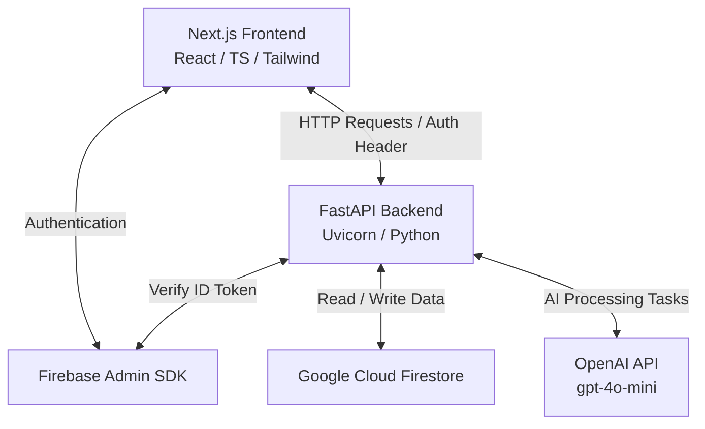
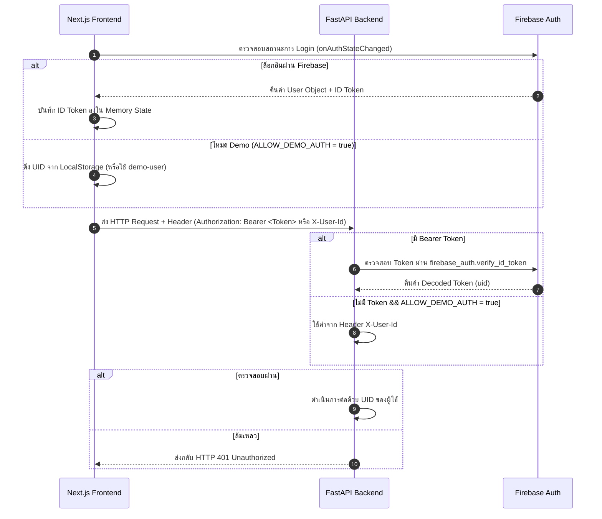
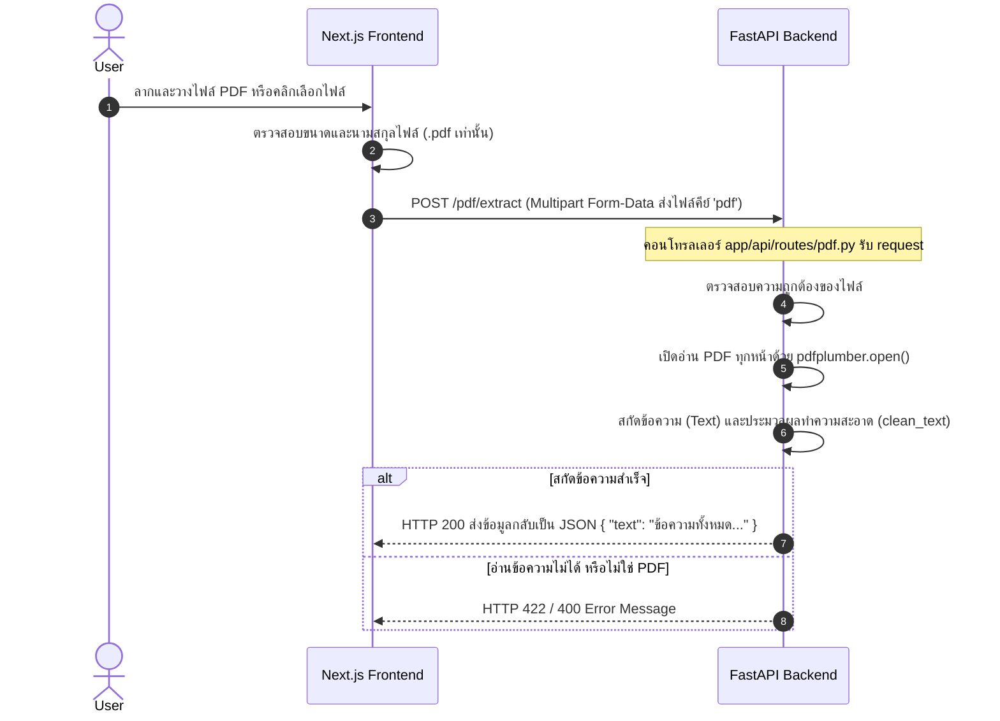
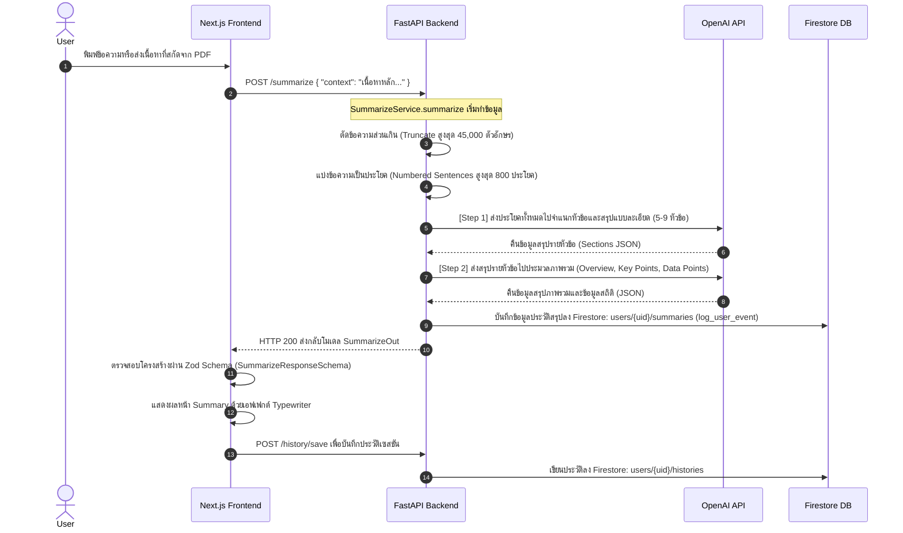
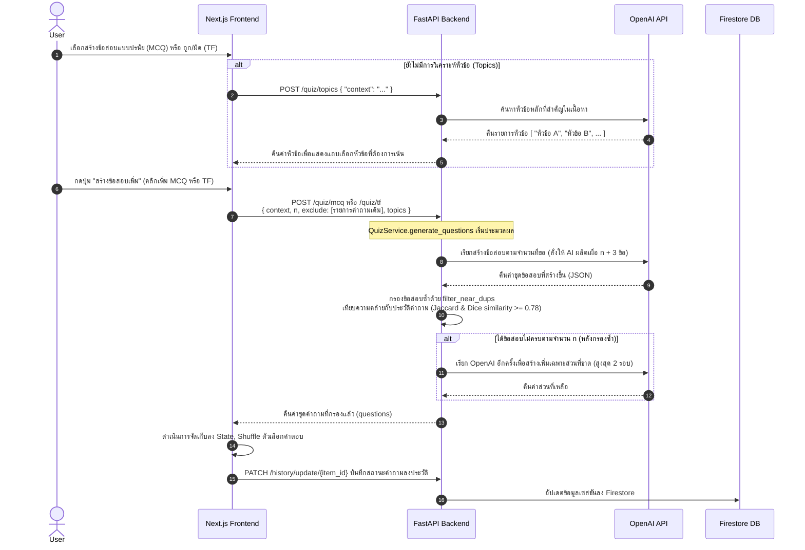
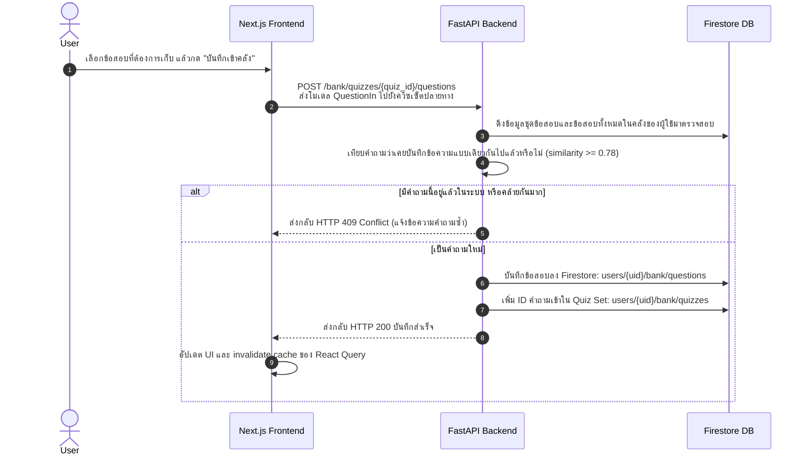
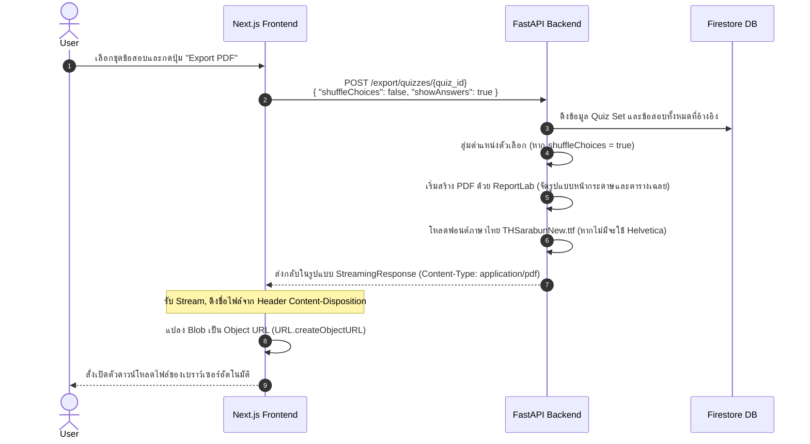

# 📖 คู่มืออธิบายการทำงานและเส้นทางการไหลของข้อมูล (EduGen Project Data Flow)

เอกสารฉบับนี้อธิบายโครงสร้างระบบ สถาปัตยกรรม และเส้นทางการส่งผ่านข้อมูล (Data Flow) ของโปรเจกต์ **EduGen** ทั้งฝั่ง Frontend (Next.js) และ Backend (FastAPI) โดยละเอียด เพื่อช่วยให้เข้าใจการทำงานร่วมกันของเทคโนโลยีแต่ละส่วน

---

## 🏗️ 1. ภาพรวมสถาปัตยกรรมของระบบ (System Architecture Overview)

ระบบ EduGen ออกแบบตามสถาปัตยกรรม **Modular Layered Architecture** แบ่งการทำงานออกเป็น 2 ชั้นหลัก ร่วมกับการเชื่อมต่อบริการภายนอก (Third-party Services):



### รายละเอียดองค์ประกอบหลัก:
1. **Frontend (Next.js 16 / React 19 / TypeScript)**: ทำหน้าที่แสดงผล UI แบบ Single-page, จัดการ State ของข้อสอบ/โน้ตการเรียนรู้ และเรียกใช้งาน API ผ่าน HTTP Client โดยมี Zod ช่วยตรวจเช็กความถูกต้องของข้อมูล (Runtime Validation)
2. **Backend (FastAPI / Python 3.10+)**: ทำหน้าที่ประมวลผล Logic ของระบบ, การสกัดข้อความจาก PDF, ตรวจสอบสิทธิ์ผู้ใช้ และติดต่อสื่อสารกับฐานข้อมูลและ OpenAI
3. **Firebase Auth**: ระบบตรวจสอบสิทธิ์ความปลอดภัย โดยฝั่ง Client จะได้รับ ID Token มาส่งแนบไปใน HTTP Header เพื่อให้ฝั่ง Backend ตรวจสอบผ่าน Firebase Admin SDK
4. **Google Cloud Firestore**: ฐานข้อมูลแบบ NoSQL Cloud Database สำหรับจัดเก็บข้อมูลเชิงสัมพันธ์ของผู้ใช้ เช่น ประวัติการใช้งาน (History), โน้ต (Notes), ข้อสอบในคลัง (Quiz Bank)
5. **OpenAI API (gpt-4o-mini)**: สมองกลของระบบ ใช้ประมวลผลภาษาธรรมชาติในการสรุปเนื้อหา ดึงประเด็นสำคัญ สกัดหัวข้อ และสร้างข้อสอบแยกตามหัวข้อ

---

## 🔒 2. ระบบยืนยันตัวตนและการเข้าถึงข้อมูล (Authentication Flow)

ก่อนที่จะเข้าถึงข้อมูลส่วนตัว ระบบจะทำการตรวจเช็กสิทธิ์ผ่าน **Firebase ID Token** หรือ **Demo Auth Mode** เพื่อความสะดวกในการพัฒนาระบบ



> [!NOTE]
> ในฝั่ง Backend มีการเขียน Custom Security Dependency ชื่อ `get_current_user` ใน `app/core/security.py` เพื่อกรองสิทธิ์ของผู้ใช้งานในระดับ Router เสมอ

---

## 📄 3. เส้นทางการสกัดข้อความจากไฟล์ PDF (PDF Extraction Flow)

เมื่อผู้ใช้อัปโหลดไฟล์ PDF ระบบจะส่งไฟล์ไปให้ Backend สกัดเอาเนื้อหาข้อความออกมาเพื่อไปใช้สำหรับสรุปและสร้างข้อสอบต่อ



---

## 🧠 4. เส้นทางการสรุปเนื้อหาด้วย AI (Content Summarization Flow)

การสรุปเนื้อหาเป็นแบบ **2-Step Generation** เพื่อความละเอียดและมีโครงสร้างข้อมูลที่ชัดเจน (Structured JSON)



---

## 📝 5. เส้นทางการสร้างข้อสอบอัจฉริยะ (Interactive Quiz Generation Flow)

เพื่อป้องกันคำถามซ้ำและการออกข้อสอบที่ไม่ออกนอกเนื้อหา ระบบมีขั้นตอนการกรองความซ้ำซ้อน (Near-duplicate filtering) ด้วยอัลกอริทึม NLP



---

## 🗃️ 6. ระบบจัดการคลังข้อสอบ (Quiz Bank & CRUD Flow)

ผู้เรียนสามารถบันทึกข้อสอบที่ต้องการเก็บไว้ทบทวนเป็นรายข้อ หรือสร้างเป็น "ชุดข้อสอบ" (Quiz Set) เอาไว้ฝึกทำในอนาคต



---

## 🖨️ 7. เส้นทางการส่งออกเอกสารเป็น PDF (PDF Export Flow)

ระบบสามารถสร้างไฟล์ PDF ของชุดข้อสอบที่เลือก พร้อมรองรับภาษาไทย และสามารถเลือกว่าจะสุ่มคำถามหรือแสดงเฉลยได้



---

## 💾 8. ตารางสรุปโครงสร้างข้อมูลในฐานข้อมูล (Firestore Collections Strategy)

ฐานข้อมูลของ EduGen ออกแบบโดยใช้ **Cloud Firestore** ในระดับ PaaS เพื่อให้ผู้ใช้งานสามารถเข้าถึงข้อมูลเดียวกันได้จากทุกอุปกรณ์

| เส้นทางคอลเลกชัน (Firestore Path) | โครงสร้างเอกสาร (Document Fields) | วัตถุประสงค์ในการเก็บข้อมูล |
| :--- | :--- | :--- |
| `users/{uid}/notes/{file_id}` | `file_id`, `content`, `updated_at` | ใช้สำหรับเก็บข้อความโน้ตย่อที่บันทึกร่วมกับไฟล์เอกสาร มีระบบ Autosave debounced 1.2s |
| `users/{uid}/bank/questions/{qid}`| `id`, `type`, `question`, `choices`, `answer`, `explain`, `topic` | เก็บข้อสอบรายข้อที่เป็นคลังส่วนตัวของผู้ใช้ |
| `users/{uid}/bank/quizzes/{quiz_id}`| `id`, `title`, `question_ids` (array), `created_at`, `updated_at` | เก็บข้อมูลกลุ่มหรือชุดข้อสอบที่มีความเชื่อมโยงไปยังคลังข้อสอบ |
| `users/{uid}/histories/{history_id}`| `fileName`, `overview`, `keyPoints`, `sections`, `questions`, `answers`, `score`, `content`, `qa_history`, `timestamp` | เก็บประวัติการเรียนรู้แต่ละเซสชัน เพื่อใช้ในการกดเรียกดูย้อนหลังหรือกลับมาทำข้อสอบเดิมต่อ |
| `users/{uid}/summaries/{auto_id}` | `overview`, `key_points`, `sections`, `data_points`, `timestamp` | บันทึกประวัติและผลลัพธ์ของระบบ AI สรุปเอกสารเพื่อเก็บสถิติ |

---

## 🛠️ 9. สรุปความก้าวหน้าการส่งผ่านข้อมูลในภาพรวม (End-to-End Summary)

```text
[อัปโหลดเอกสาร] ──> (Next.js) ──> [ไฟล์ PDF] ──> (FastAPI) ──> สกัดข้อความ (pdfplumber)
                                                                       │
[ผลลัพธ์ข้อมูล] <── (Next.js) <── [สรุปเนื้อหา / ข้อสอบ] <── (OpenAI) <──┘
       │
       ├─> [บันทึกประวัติ] ──> (FastAPI) ──> [Firestore: histories]
       ├─> [จดบันทึกย่อ] ───> (FastAPI) ──> [Firestore: notes]
       └─> [เก็บคลังข้อสอบ] ─> (FastAPI) ──> [Firestore: bank] ──> [ส่งออก PDF (ReportLab)]
```

> [!TIP]
> **เทคนิคเด่นในงานสถาปัตยกรรมนี้:**
> * **React Query (TanStack)** ช่วยจัดการ Cache ข้อมูลการเรียกคลังข้อสอบและประวัติ ทำให้ UI โหลดได้รวดเร็วทันทีโดยไม่ต้องยิง API ใหม่ซ้ำ ๆ
> * **Dice Bigram & Jaccard Index** ช่วยกรองความซ้ำซ้อนของคำถามระดับตัวอักษรและกลุ่มคำ ทำให้ได้ข้อสอบที่หลากหลายเนื้อหา
